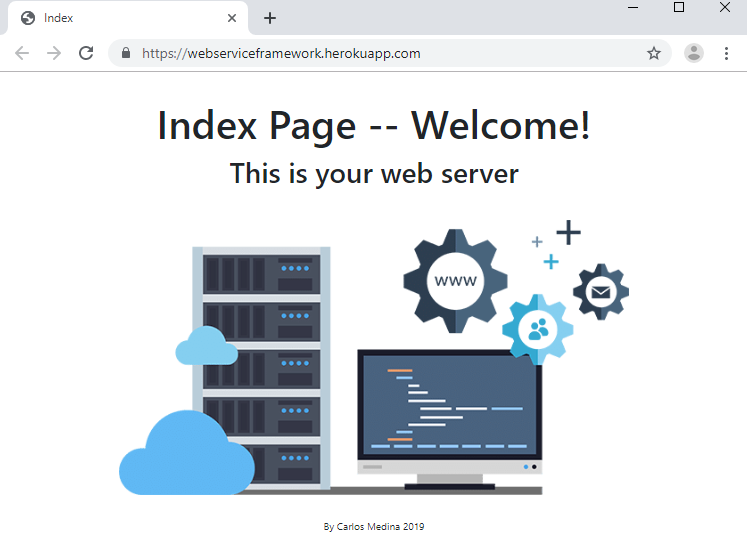
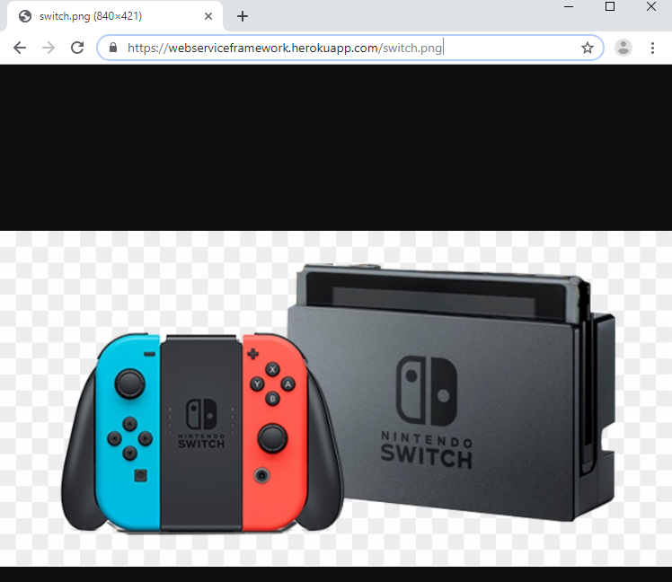
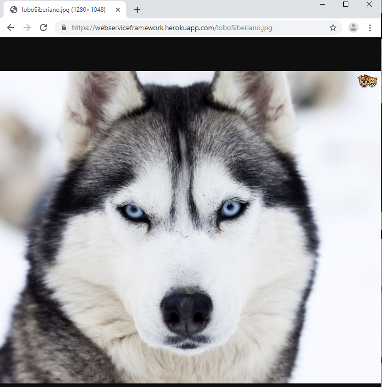
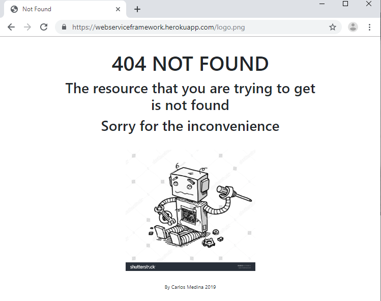
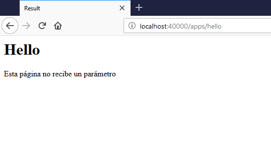
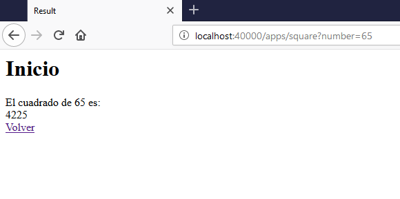

# Web Service Framework

Este proyecto es un framework que permite a un desarrollador crear un servicio web que responda a peticiones estáticas o también mediante anotaciones sobre los métodos creados por el desarrollador y que responderán a lo que desea. Estas anotaciones permitirán enviar parámetros en la URL con el fin que los métodos tomen dichos parámetros y ejecuten su función.

## Empezando

Estas instrucciones le proporcionarán una copia del proyecto, además de una guía para ejecutarlo en su máquina local para fines de desarrollo o pruebas.

### Prerrequisitos

Las siguientes son softwares necesarios para ejecutar el proyecto de manera local.

- Java JDK 1.8 --> [Guía de Instalación Java JDK 1.8](https://www3.ntu.edu.sg/home/ehchua/programming/howto/JDK_Howto.html)
- Apache Maven 3.5.4 --> [Guía de Instalación Apache Maven 3.5.4](https://docs.wso2.com/display/IS323/Installing+Apache+Maven+on+Windows)

### Instalando

Para poder descargar el proyecto y usarlo para desarrollo o pruebas, se deben realizar los siguientes pasos en consola de comandos:

1. Se clona el proyecto:

	> git clone https://github.com/CarlosCL98/WebServiceFramework.git

2. Se accede a la carpeta y se realizan los siguientes comandos para que se descarguen todas las dependencias necesarios:

	> mvn compile
	>
	> mvn package

3. Ahora se inicia la clase **Controller**, de manera que se inicialicen las clases y el servidor comience a escuchar.
4. Ya que está de forma local, se debe acceder de la siguiente forma y deberá aparecer el index del servidor:
 
	> http://localhost:40000/

## Documentación
Para ver la documentación del framework y más información sobre las funcionalidades, acceda al siguiente link: 

[API Web Service Framework](https://carloscl98.github.io/WebServiceFramework/src/main/resources/site/apidocs/index.html)

## Arquitectura
Para ver la arquitectura e implementación realizada se puede acceder al siguiente documento ubicado en la raíz del proyecto [Arquitectura de Web Service Framework](ArticuloArquitectura.pdf)

## Despliegue
El proyecto está desplegado en Heroku en la siguiente dirección [Heroku WebServiceFramework](https://webserviceframework.herokuapp.com/)

## Pruebas
- Acceder a la página principal del servidor web.

- Traer recursos estáticos

- Intentar traer algún recurso que no se encuentre.

- Recurso dinámico sin parámetro

- Recurso dinámico con parámetro

## Colaborador

Agradezco a Luis Daniel Benavides Navarro, Ph.D., quien ha estado presente y en constante revisión del presente proyecto.

## Author

* **Carlos Andrés Medina Rivas** estudiante de Ingeniería de Sistemas en Escuela Colombiana de Ingeniería Julio Garavito.

## License

Este proyecto está licenciado bajo **GNU Free Documentation License** - ver el archivo [LICENSE.md](LICENSE.md) para más detalles.